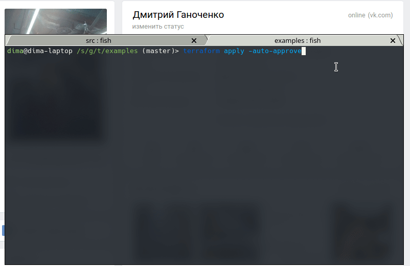

# terraform-vk-status-provider
This is a [Terraform](https://www.terraform.io/) provider for setting status [Vkontakte](https://vk.com)

# installation

```bash
$ cd src
$ go mod download
$ ./build.sh
```

## requirements

- [Terraform](https://www.terraform.io/downloads.html) >= v0.12.0
- Access_token: follow the instructions on [this site](https://vkhost.github.io/)

## resources

```hcl
provider "vkstatus" {
  access_token   = "..."
}

terraform {
  required_providers {
    vkstatus = {
      source = "dmitrii/vkstatus"
      version = ">= 0.0.1"
    }
  }
}

resource "vkstatus_status" "..." {
  status_text = "<new status>"
}
```

## usage


